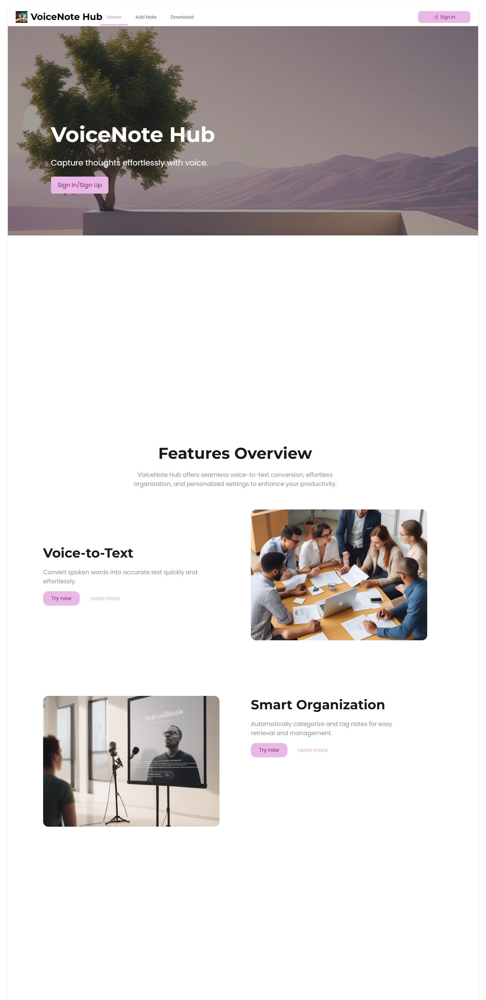

# Voice-based-note-taker

 ## Overview
  The **Voice Based Note Taker** is the web application that allows the user to create, edit, view, delete, save the notes using voice commands.
  The application uses **speech-to-text** technology to convert spoken words into written text, allowing user to dictate their notes hands-free.By simply speaking into the microphone, users can dictate their notes, which are then **transcribed into text** and stored for later use. 

  ## Objective
  - **Voice enabled note taking application**.
  - To create a simple user friendly design that works across devies like **desktop** , **mobile**.
  - Offer a download option to export notes as **.txt**.
  - Utilize **speech-to-text technology** for accurate transcription.

  ## Project Workflow
  1. *Home Page :*
      - The main page where the user can record note using voice input and view the text.
      - In the home page itself they can delete,copy and download the text into **.tst** format.
      - You can view the instructions to how to use the microphone as **text converter** in the home page. 
  
  ## Tech Stack
  1. Frontend :
      - HTML
      - CSS
      - JavaScript
      - Web Speech API
  1. Backend :
     -
# Deployment Link
 **Link** : https://voice-notes-three.vercel.app/
     
# Images 

## Home page

  

     
